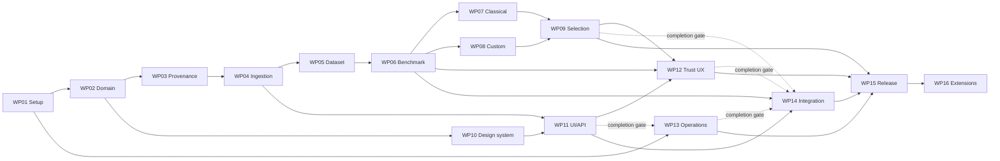

# GridOracle build plan

Updated 2026-09-30. **Current state: WP01–08 integrated; WP09 assigned under the frozen v2 benchmark.**

For assignment prompts, ownership rules and state transitions, read the [agent execution guide](docs/workplans/README.md). Fresh agents start at [HANDOFF](HANDOFF.md).

## Read in this order

1. [Ideal state](docs/IDEAL_STATE.md) — product destination, multi-season domain, ML strategy, UI directions and homelab architecture.
2. [Repository review](docs/REPOSITORY_REVIEW.md) — 36 findings, measured checks and improvement catalogue.
3. [Design review](docs/DESIGN_REVIEW.md) — critical review of the proposal, revisions and remaining limitations.
4. [Decisions](DECISIONS.md) — confirmed requirements versus recommendations and open choices.
5. [Workplans](WORKPLANS.md) — implementation packages, dependencies, acceptance and handoff requirements.
6. [Sources](docs/SOURCES.md) and [real-data experiment](docs/evidence/README.md) — supporting methodology and reproducible baseline evidence.

## Owner intent to preserve

Public F1 fan product; clear probabilities before the weekend and after qualifying; reusable across seasons; new UI identity explored through alternatives; initially free data and homelab hosting. Accuracy takes priority over a favored algorithm. A custom model and additional training compute are welcome learning/research work. Available personal research machines: gaming PC with a 5060 GPU and M1 MacBook Pro. Homelab wiki access is **read-only**.

The repository already uses XGBoost. Repair temporal evaluation, lineage and publication before trusting scores from any replacement. The current model's real accuracy remains unknown: no trained artifact/data was available for this review. Qualifying-order baseline data from 91 historical races is descriptive evidence, not the model's score or a verified as-of test.

**UI approved:** the owner approved the latest OpenAI-platform-inspired, F1-themed dashboard on 2026-09-28. Use the [preserved reference](docs/design/APPROVED_UI.md). WP10 completes tokens and screen/state coverage; it does not reopen the identity choice. Earlier styling recommendations are superseded.

## Roadmap and release gates

| Phase                         | Packages | Gate before moving on                                                                                                           |
| ----------------------------- | -------- | ------------------------------------------------------------------------------------------------------------------------------- |
| A. Reproducible foundation    | WP01–03  | Safe setup, season/target specification, migration ledger and immutable forecast identity.                                      |
| B. Trusted data and benchmark | WP04–06  | Recoverable jobs, audited point-in-time features, coverage report, locked temporal benchmark and baselines.                     |
| C. Accuracy research          | WP07–09  | Fair comparison of classical, hierarchical and custom models; coherent calibrated outputs; evidence-based selection by horizon. |
| D. New fan experience         | WP10–12  | Approved design completed into a system, season-safe navigation, probability UI and public scorecard.                           |
| E. Operable release           | WP13–15  | Measured placement, restore drill, end-to-end checks, prospective shadowing and separately authorized deployment.               |
| F. Expansion                  | WP16     | Each extension justifies its user value, data and validation.                                                                   |

## Assignment order

**Safe serial order:** WP01 → WP02 → WP03 → WP04 → WP05 → WP06 → WP07 → WP08 → WP09 → WP10 → WP11 → WP12 → WP13 → WP14 → WP15. WP16 is optional, separately scoped expansion. Package numbers are stable IDs, not a requirement to delay independent work.

For concurrent assignments, use these tracks:

1. **Foundation/data:** WP01 → WP02 → WP03 → WP04 → WP05 → WP06.
2. **UI:** WP10 after WP02; WP11 after WP10 and WP03–04. WP12 waits for WP06, WP09 and WP11.
3. **Research:** WP07 and WP08 can run independently after WP06; both feed WP09. Share the frozen benchmark and coordinate shared files. A custom-model loss is still a completed experiment when its acceptance evidence is complete.
4. **Operations:** WP13 can start discovery after WP01, but final staging/restore evidence waits for WP03–04 and WP11. It cannot be marked complete from a design proposal alone.
5. **Integration/release:** WP14 starts after WP04, WP06 and WP11; it finishes only after WP09, WP12 and WP13 are integrated and tested. WP15 follows WP09 and WP12–14. Its prospective race window is calendar time, not something an agent can manufacture in one session.

Start dependencies below require completed, integrated package evidence. Early sketches are allowed only as explicitly assigned subtasks, never as substitutes for prerequisites. Overlapping implementations need allocated files/contracts and isolated worktrees. No agents are launched by this plan.

## Execution ledger

The coordinator updates this overview when assigning or integrating work. Detailed, authoritative progress lives in each linked state record; working-branch progress is not integrated completion. WP01–08 are complete. WP09 is active; WP10 is ready to assign; WP13 may begin its limited discovery/design scope after WP01. No dependent implementation is assigned by this status update.

| Package / state record         | Status     | Start after            | Additional completion gate                           |
| ------------------------------ | ---------- | ---------------------- | ---------------------------------------------------- |
| [WP01](docs/workplans/WP01.md) | `complete` | None                   | Integrated as `3cb5bd1c`                             |
| [WP02](docs/workplans/WP02.md) | `complete` | WP01                   | Integrated as `ce9690e` through PR #95               |
| [WP03](docs/workplans/WP03.md) | `complete` | WP02                   | Integrated as `9c57877` through PR #96               |
| [WP04](docs/workplans/WP04.md) | `complete` | WP02, WP03             | Integrated as `f2a722a` through PR #97               |
| [WP05](docs/workplans/WP05.md) | `complete` | WP03, WP04             | Integrated as `927c9ec` through PR #98               |
| [WP06](docs/workplans/WP06.md) | `complete` | WP05                   | Integrated as `b9439e7` through PR #99               |
| [WP07](docs/workplans/WP07.md) | `complete` | WP06                   | Integrated as `32b1f60` through PR #101                |
| [WP08](docs/workplans/WP08.md) | `complete` | WP06                   | Integrated as `3ad2113` through PR #102                |
| [WP09](docs/workplans/WP09.md) | `active`   | WP03, WP07, WP08       | Codex `/root`; owner-assigned selection/calibration    |
| [WP10](docs/workplans/WP10.md) | `ready`    | WP02                   | Acceptance, PR review and integration                |
| [WP11](docs/workplans/WP11.md) | `waiting`  | WP03, WP04, WP10       | Acceptance, review and integration                   |
| [WP12](docs/workplans/WP12.md) | `waiting`  | WP06, WP09, WP11       | Acceptance, review and integration                   |
| [WP13](docs/workplans/WP13.md) | `waiting`  | WP01                   | WP03, WP04, WP11                                     |
| [WP14](docs/workplans/WP14.md) | `waiting`  | WP04, WP06, WP11       | WP09, WP12, WP13                                     |
| [WP15](docs/workplans/WP15.md) | `waiting`  | WP09, WP12, WP13, WP14 | Acceptance, review and integration                   |
| [WP16](docs/workplans/WP16.md) | `deferred` | WP15                   | Explicitly selected extension and its own acceptance |

WP13/WP14 include separate start and finish gates. Every package, including those with additional dependencies, still requires acceptance, review and integration before `complete`.

## Exact next action for the next implementation agent

The owner assigned **WP09** to Codex `/root` on 2026-09-30, and explicitly
authorized correction of stale prerequisite tracking in one commit on its branch
before continuing. GitHub confirms PR #96 at `9c57877aac5ac311944d8d5eea31f46eb39acbee`,
PR #101 at `32b1f60c3116fe6d02e7c55c92b7461f5fb7eaf4`, and PR #102 at
`3ad2113186a715215e484e11950541a61577c09f` are merged into main.
Consume the frozen WP06 v2 protocol and retained WP07/WP08 artifacts. Keep the
metrics, splits and tolerances locked; explored history is not prospective or
as-of promotion evidence. WP09's exact implementation action is in its state.
WP10 remains independently assignable.

The model winner, deployment host and public route remain unresolved; their decision gates are specified, so they need not block unrelated ready work.

## Keeping this plan useful

Agents create a short-lived package branch before editing, then commit, push and open a ready-for-review GitHub PR to `main` before entering `review_ready`. A reviewer checks that PR; the coordinator merges the approved PR and records the integrated revision before unlocking dependencies. Update the package record at milestones and before stopping; the coordinator refreshes this ledger after assignment/integration and links PR/commit/report/test evidence. Keep one current next assignment here and one exact next action per active package. Record decisions in DECISIONS rather than burying them in task chat. Preserve failures in research reports. Ask the owner only about the specific unresolved decision needed for the next dependent action; other ready work can continue. A green unit suite, attractive UI or lower in-sample loss is not sufficient to mark forecast quality complete.
