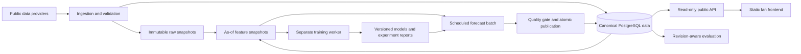

# GridOracle: ideal product and technical state

Version 1 · 2026-09-28 · Reviewed in [DESIGN_REVIEW](DESIGN_REVIEW.md)

## Product promise

GridOracle helps an F1 fan understand **what is likely to happen, what changed after qualifying, and how much trust the forecasts have earned**. It is a public, season-reusable forecasting and analysis product, with a separate research environment where its owner can learn machine learning by building a custom model.

The user confirmed: public fan audience; pre-weekend and post-qualifying probabilities; initially free data and homelab hosting; a new visual identity with multiple design options; and willingness to dedicate extra training resources for a custom model. Their later clarification makes **the most accurate product the priority over any preferred ML technique**. Available research machines are a gaming PC with a 5060 GPU and an M1 MacBook Pro. Exact GPU model/VRAM, system RAM, operating system and archive depth remain open. The latest dashboard visual direction is now owner-approved; see the preserved reference below. Live race prediction, betting advice and commercial subscriptions are outside the agreed core. CPU operation is the portable baseline, not a permanent research limit.

The architecture below is a proposed destination. Numerical service targets are initial engineering budgets to validate, not measurements of the current system. Current defects and actual measurements are in [REPOSITORY_REVIEW](REPOSITORY_REVIEW.md); source IDs refer to [SOURCES](SOURCES.md).

## 1. The finished fan experience

The home page opens on the active race weekend. A clear season/event selector makes every previous season navigable without changing deployments. Each race page shows the chosen forecast horizon, issue time, information cutoff, input completeness, and whether it is live-issued or retrospectively reconstructed.

The first screen answers three questions: who is most likely to win, how close are the contenders, and what changed since the earlier forecast? It shows a compact probability comparison, not a decorative podium presented as certainty. A full field table provides win, podium and top-ten chances, an expected result order, and a useful range. A driver detail view explains the strongest model associations in plain language and links to source freshness. Associations are not described as causal effects.

After the race, that same page compares the frozen pre-weekend and post-qualifying forecasts with a clearly versioned result. A public performance page displays the model and baseline side by side on the same races, along with coverage, sample size, calibration and difficult races. The archive preserves every published forecast and its corrections. A model that did badly remains visible.

Additional destination features: driver/team and circuit pages, season standings including sprints, local-time schedule, favorite drivers stored on device, accessible share cards, a methods glossary, model cards, license-aware downloads and a visible service/data status page. Championship forecasts and what-if scenarios are later extensions, with separate validation and unmistakable hypothetical labels.

### Visual direction: preserve the UX, strengthen the F1 identity

Owner feedback, 2026-09-28: **“I like the UX but the UI doesn't feel very F1.”** They clarified that the concepts feel too generic and named the **OpenAI platform dashboard, made F1-themed**, as the design reference. Preserve the preview's navigation destinations, information hierarchy, horizon comparison and explanation flow. The first preview's visual treatment is rejected; this does not reject the underlying UX.

Interpret that reference as a calm, precise dashboard shell: understated sidebar, compact page header, neutral surfaces, thin dividers, modest corner radii and clear local controls. Give it a distinctive motorsport identity through condensed race/driver typography, timing-screen numerals, numbered driver rows, season-correct team color strips and restrained race-red or sector-purple accents. Body copy stays in a readable sans serif. The race and probabilities take priority over a decorative hero. This is a design interpretation of the owner's reference, not a claim to reproduce the current authenticated OpenAI interface.

The owner approved the revised dashboard on 2026-09-28: **“Love it.”** The [approved reference](design/APPROVED_UI.md) preserves the exact concept and defines its implementation boundary. Adopt the default understated treatment with race-red accents and light/dark support. Stronger broadcast and purple options remain alternatives, not required variants. Keep uncertainty and freshness readable; color must supplement text. Do not copy official F1/OpenAI logos or proprietary brand assets. Complete mobile/desktop states and tokens through WP10 without reopening the approved identity or treating the earlier Journal recommendation as current.

Visual acceptance: the owner recognizes both the calm dashboard reference and an F1 identity; changing the race/season changes its content without changing its page structure; the two forecast horizons remain immediately comparable; the winner probability and its uncertainty are readable at a glance. A red recoloring alone does not satisfy the brief. The concept is preference exploration, not evidence of usability or prediction quality.

### UI rules and states

- Use shared semantic tokens, accessible typography, chart colors with text labels, keyboard support, visible focus, reduced-motion behavior, and WCAG 2.2 AA contrast/reflow. Design for 360px first and test 320px reflow. Do not inherit today's low-contrast 10px labels. [S16]
- Global state lives in URLs such as `/seasons/2027/races/<stable-event-slug>?horizon=post_qualifying&run=<id>`. Season is not an isolated dropdown inside one page.
- Distinguish loading, forecast not due, waiting for qualifying, partial data, provider unavailable, stale last-good forecast, cancelled event, race completed and result under revision. Unknown probabilities are not zero.
- Mobile uses a compact event picker and drawer; full-field tables prioritize driver and selected outcome, with accessible detail expansion. Charts always have textual equivalents.
- Public pages do not show internal hostnames, job IDs or training stack details. A methods section can expose meaningful model/data versions.
- Generate API types from an explicit contract; use a server-state cache with cancellation and consistent errors. Lazy-load research charts. Add social metadata and indexable race summaries through prerendering; a framework migration is optional, not a prerequisite.

## 2. Seasons are data, rules and capabilities

“Reusable every season” means one application and one durable archive, not annual code forks or duplicated sites. Opening a new season consists of importing a reviewed configuration and data, validating completeness, and selecting the active season.

Persist a `season` with lifecycle (`draft`, `active`, `archived`), applicable ruleset, timezone-aware sessions, source identifiers, expected entry policy and data capabilities. Keep human-reviewed configuration files under version control; import versioned revisions into the database. A proposed future command is `gridoracle season prepare --year 2027 --dry-run`; it does not exist yet.

Model these concepts explicitly:

| Concept            | Essential distinction                                                                                                            |
| ------------------ | -------------------------------------------------------------------------------------------------------------------------------- |
| Circuit and layout | Stable venue identity versus layout version; event title is not circuit identity.                                                |
| Event and session  | Calendar edition versus practice/qualifying/sprint/race sessions; format and start time can change.                              |
| Entry              | Race-specific driver, team identity, car number, participation status and when the entry became known.                           |
| Team               | Organization continuity versus renamed constructor/season branding; continuity is a reviewed mapping, not name guessing.         |
| Classification     | Official status, classified position if applicable, provider order, laps and result revision; retirement is separate from rank.  |
| Ruleset            | GP/sprint scoring, fastest-lap eligibility when applicable, shortened races and countback rules; effective versions and sources. |
| Capability         | Results-only, qualifying, timing, stint, weather-forecast coverage; absent data is explicit.                                     |

Handle reserves and midseason transfers, new teams, 20/22/other field sizes, cancelled/postponed rounds, repeated venues, changed session formats, pit-lane starts, late penalties, disqualifications and new circuits. Historical branding stays historical. New entrants receive pooled priors rather than invented records. An 11th team is an actual requirement, not speculation. [S9]

**Rollover acceptance:** adding the next season requires configuration/data updates but no application code changes; historical pages, roster mappings and published runs remain unchanged. Detailed analysis from 2018 onward is a provisional coverage target; results-only older archives are optional and must disclose their lower data capability. [S4]

## 3. The data foundation

Use provider adapters with typed records, source IDs, throttling, caching and contract fixtures. Jolpica is the primary candidate for results/calendar/standings; FastF1 supplies timing and stint features; OpenF1 is an optional cross-check, not a live-data dependency. Evaluate Open-Meteo for free weather access while retaining a provider-neutral interface. Free means a non-commercial operating assumption; recheck licenses before advertising, subscriptions or redistributing datasets. [S1–S8]

Three layers are sufficient:

1. **Raw snapshots:** immutable compressed responses, endpoint/query, retrieval time, source timestamp if available, checksum, parser version, terms/attribution reference. Provider corrections produce new snapshots.
2. **Canonical facts:** stable identities, sessions, entries, classification revisions, lap/stint records and weather runs. Validate and quarantine malformed or incomplete data.
3. **Feature snapshots:** one versioned feature vector per entry, horizon and information cutoff, tied to raw/canonical snapshot IDs and a feature schema. Rebuilding never overwrites the snapshot used by a published forecast.

Keep both **event/valid time** and **availability time**. For live inputs, `observed_at` provides conservative evidence of availability. Historical imports need a provenance grade: `verified_as_of`, `reconstructed`, or `availability_unknown`; invented old `observed_at` timestamps are prohibited. Labels can be settled after the race, but features and training labels for a replay must obey the historical cutoff.

Weather is especially important: select values valid during the race, capture issue time and provider release lag, and never substitute realized race weather or a modern hindcast into a claimed historical forecast. A historical forecast archive is not automatically an as-issued archive. Use a weather-free evaluation cohort when provenance is insufficient. [S7–S8]

Initial features worth testing: recent relative qualifying pace; recency-weighted race pace and results; team/driver form; circuit family and layout; known grid/penalty state; standings including sprints; availability flags; normalized within-session practice pace; wet-weather history with uncertainty; status-normalized reliability. Add stint degradation, traffic, tyre age and pit-stop information only after measurement definitions and cleaning are credible. Fuel load is generally unobserved: practice pace is a noisy proxy, not pure car speed.

Feature documentation must state units, horizon eligibility, source, temporal joins, missingness policy and expected failure modes. Missing values should remain missing or use training-fitted/explicit pooled estimates with indicators. Circuit medians and rookie priors must use only available information. Every added feature gets an ablation; more columns do not establish more signal.

## 4. Forecast contracts and publication

Define two independent products, each with its own eligible inputs, benchmark and calibration:

- **Pre-weekend:** issue at a configurable offset before the first competitive weekend session, using an entry-list snapshot, historical form and available forecast weather. Never use that weekend's future qualifying or practice information.
- **Post-qualifying:** issue after qualifying data passes completeness checks, using qualifying information and only penalties/grid revisions known by the declared cutoff. On sprint weekends, the session contract determines exactly what has happened. A later final-grid update is a new revision/horizon, not an overwrite.

Persist actual `issued_at`, `information_cutoff`, `training_label_cutoff`, input manifest, entry-field hash, horizon, model/artifact/calibrator versions, code/config hash and publication state. A run issued after the race begins cannot count as a live pre-race forecast even if its nominal cutoff is earlier. A delayed valid run visibly reports its delay.

Proposed core tables: `seasons`, `season_rulesets`, `circuits`, `circuit_layouts`, `events`, `sessions`, `entries`, `provider_snapshots`, `result_revisions`, `feature_snapshots`, `datasets`, `model_versions`, `experiment_runs`, `forecast_runs`, `forecast_entry_outputs`, `publication_selections`, `evaluation_runs`, `job_runs`. Avoid adding a separate service for each table.

Unique run identity includes event, horizon, cutoff, input manifest and model identity. A successful retry returns the same run. Publish the whole validated field atomically; partial driver writes must never appear as a complete forecast. Maintain a pointer to the selected last-good run separately from immutable outputs. Result corrections create a new evaluation revision without rewriting what the model predicted.

## 5. Prediction engine and custom-model learning track

### Define targets before architectures

Specify a versioned target contract with a canonical status taxonomy (`finished`, `classified_retirement`, `unclassified_retirement`, `DNS`, `DSQ`, `unknown`) and source-specific mappings. Preserve official classified position separately from a deterministic total result order used for ranking experiments. A driver can retire and still be classified; do not equate retirement with missing position or zero points.

Public outcomes: race win, podium, top-ten result, result-order distribution/range, and retirement probability when validated. Points probability is separate because scoring rules, penalties and classification matter. The label policy must explicitly resolve DNS/DSQ/unorderable rows and report any exclusions. Never invent an official classified place for DNS or DSQ to fill a matrix.

A joint permutation model can represent total order over a **fixed forecast entry set**. Its marginal matrix has row and column sums of one, and top-k membership probabilities sum to k. These invariants apply to that total-order target only. A richer official-classification distribution with non-ranked outcomes needs explicit extra states and different normalization. Entry changes invalidate or supersede the old field forecast; they are not silently removed from its evaluation denominator.

### Model ladder

| Candidate                                                                                   | Purpose                                                                                                                                      | Evidence required                                                                                                 |
| ------------------------------------------------------------------------------------------- | -------------------------------------------------------------------------------------------------------------------------------------------- | ----------------------------------------------------------------------------------------------------------------- |
| Uniform/event-frequency probabilistic baselines; qualifying order; rolling team/driver form | Establish how much skill is available with minimal complexity; pre-weekend cannot use qualifying.                                            | Exact same cohorts, horizons, targets and cutoff data as challengers.                                             |
| Corrected regularized XGBoost regression and XGBoost ranking                                | Strong CPU-friendly tabular challengers; group each race as one query; test pairwise versus top-heavy ranking objectives.                    | Time-valid tuning, feature ablations, score exact served ranking, fit probabilistic decoder separately. [S13–S14] |
| Dynamic hierarchical skill / Plackett–Luce                                                  | Learn driver and team strengths with shrinkage and principled competition between entrants.                                                  | Identifiability constraints, cold-start behavior, diagnostics and held-out performance. [S15]                     |
| **Custom PyTorch probabilistic ranking model**                                              | First-class learning project: learned driver/team/circuit interactions and a race-conditioned scoring network trained on ranking likelihood. | Custom loss tests, temporal dataset, calibrated joint outcomes, ablation report and reproducible training.        |
| Ensemble / richer race-outcome simulator                                                    | Combine complementary models or shared uncertainty if demonstrated useful.                                                                   | Out-of-fold training only; genuine incremental gain and coherence; complexity/compute accounting.                 |

These are experiments, not an assumption that the deepest model will win. The public-data audit contains only 92 race events across the current four-season bootstrap window. Correlated entrants and laps do not eliminate that small-outcome-sample constraint. Learning value is an independent success criterion; a model that teaches something but loses remains a documented research result. [E2, S14]

### Custom model curriculum and design

Start with a NumPy/log-linear Plackett–Luce likelihood, then implement the equivalent loss using stable `logsumexp` in PyTorch. Learn latent driver/team effects with strong shrinkage and time decay. Anchor additive effects (for example zero-centered team/driver effects) to avoid unidentifiable offsets. Treat circuit interactions as small regularized effects. New drivers/teams get an explicit unknown embedding or hierarchical prior, never an untrained arbitrary vector.

Next test a small nonlinear network over normalized tabular features and compact embeddings. Maintain separate horizon heads or models. Batch complete variable-size race fields with masks; never shuffle entrants into independent train/test folds. Historical driver/team indices are derived from training data and unknowns handled explicitly. Start small enough for CPU debugging; add capacity only after a learning curve and error analysis show a reason.

Learn by producing: a data card; derivation of the loss; unit tests against hand-calculated tiny races and finite-difference gradients; a tiny-dataset overfit sanity check; training/validation curves; experiment diary; cold-start and shuffled-input tests; feature/model ablations; calibration report; and a saved model loaded in a clean process. Research notebooks explain results; reusable training lives in tested modules and configuration-driven commands. PyTorch's [basics](https://docs.pytorch.org/tutorials/beginner/basics/intro.html) provide the reference for the training workflow.

A basic Plackett–Luce model makes restrictive substitution assumptions and does not model all shared incidents. Later experiments can mix latent pace/reliability scenarios or hierarchical uncertainty. Team-wide failures and weather conditions are correlated: do not independently sample every driver's result and then pretend duplicates form a valid race. A Monte Carlo simulator produces outcome estimates, not automatic calibration. Measure simulation error and predictive calibration separately.

### Probability generation and calibration

Ranker/regressor scores need a learned probabilistic interpretation; dividing score gaps by a maximum is invalid. A candidate decoder uses a race-wise Plackett–Luce distribution with temperature learned on earlier, out-of-sample calibration races. Obtain win probability analytically and other marginals through a seeded joint permutation sampler or verified exact computation. Tune temperature on proper scores and check calibration across outcomes, not just winner ranking.

Prefer a coherent distribution from which all public marginals are derived. Independently calibrating winner/podium/top-ten heads can break ordering or field sums; such heads are diagnostic challengers unless reconciled and re-evaluated. Preserve `P(win) ≤ P(podium) ≤ P(top10)` and valid bounds. For 20,000 independent simulation draws, the worst-case standard error of a probability is about 0.35 percentage points (`sqrt(.25/20000)`); that is a proposed numerical budget, not model uncertainty. Round probabilities honestly.

## 6. Evaluation that can earn trust

1. Create ordered, whole-race folds. Within each outer test block, all training and calibration races precede the test cutoff. Feature transforms, selection and hyperparameters are fitted using inner chronological folds only. Do not apply row-level `TimeSeriesSplit` blindly. [S10–S11]
2. Build separate pre-weekend and post-qualifying datasets. Use the same historical availability policy in training and serving; reconstructed/unknown-provenance features are separately reported.
3. Use earlier out-of-sample predictions for calibration and any ensemble weights. Reserve a final untouched future block or prospective period. Because this review already inspected 2022–25 baselines and development history exists, do not advertise those seasons as pristine unseen evidence.
4. Fit the deployment model on eligible past data only after evaluation is locked. Fit/refit calibration using a documented chronological strategy; never silently reuse training predictions to calibrate a refitted model.
5. Publish per-race losses, horizon, result revision, coverage and exclusions. Report equal race-weighted metrics; retain driver-level denominators and field-size-normalized rank error for cross-era comparisons.

Primary probability score: race-level multiclass winner log loss. Secondary: winner Brier score, podium/top-ten marginal Brier scores, ranking likelihood or ranked probability score when its target is valid, MAE of served result order, Spearman/Kendall rank agreement, winner hit rate and top-k set overlap. Exact full-grid accuracy is a curiosity, not the product's optimization goal. Calibration plots need bin counts and uncertainty; a better Brier score alone does not prove better calibration. [S12]

Use paired differences on identical races; bootstrap race blocks and examine season-level sensitivity rather than bootstrapping individual drivers. Report wet/dry (as a post-race diagnostic only), sprint/normal, circuit family, early-season, rookie and regulation-era slices, with sample sizes. Do not claim significance from tiny slices.

**Proposed promotion gate:** improve winner log loss over the declared strongest eligible baseline and incumbent, with the paired 95% interval for loss improvement above zero on the locked evaluation; show no material secondary-metric regression under tolerances recorded before testing; satisfy coverage/calibration/coherence/resource checks; then shadow at least six eligible live races. Six races test operation, not statistical certainty. If evidence is inconclusive, keep the incumbent or honest baseline and label the challenger experimental. No predetermined “90% accuracy” promise.

## 7. Runtime and homelab architecture

Keep a modular monolith: FastAPI, PostgreSQL, Python batch workers, React/TypeScript static frontend, a local artifact/snapshot directory, and versioned configuration. Use one durable PostgreSQL job ledger plus a single scheduler/worker initially. Add queue infrastructure only when observed contention warrants it. Experiment tracking begins with manifests and reports; a local optional MLflow UI can help learning without becoming a public-serving dependency.

The public API serves precomputed forecasts. No page view triggers ingestion, training or simulation. Keep the last-good forecast available through training failures; retain its original issue time and stale badge.

The wiki shows an 8 GB Pi app node, a 4 GB Pi infrastructure node, and a 16 GB Proxmox host with 17.5 GiB of listed guest allocations. Allocation is not measured usage, and ballooning/cache/overcommit matter; do not claim a host is out of memory. It does mean a new 8 GB training VM cannot be assumed free. Reuse existing Traefik, Prometheus/Grafana, logs, traces and uptime checks. Keep heavy training off the critical DNS/ingress node. [E4]

**Proposed placement:** serve a small stack on the app node only after checking real spare RAM/IO and native ARM dependencies. Otherwise use a deliberately sized application guest after capacity review. Use the 5060-equipped gaming PC for CUDA experiments after verifying its exact hardware, driver and compatible framework build; use the M1 MacBook Pro for development, CPU baselines and supported MPS experiments. Keep a CPU fallback and validate numerical/output parity within documented tolerances across backends. A GPU speeds experiments; it does not itself improve the statistical quality of predictions. Export artifacts and precomputed forecasts to the serving environment. The public service must keep working while either personal machine is off. Do not assume Hermes or media guests are available for repurposing. Public ingress is unresolved: the wiki's internal routes and wildcard DNS certificate do not prove a safe internet route exists.

**Initial budgets to measure:** API 256–512 MiB, database 512–1,024 MiB, static frontend below 128 MiB, one ingestion worker 512 MiB–2 GiB; training worker starts with 2 CPU threads and a configurable memory cap. These are planning estimates, not deployment reservations. Limit backfill concurrency, cache expensive sessions, and avoid raw telemetry until it earns its storage cost. Add native ARM64/AMD64 smoke tests and benchmark model dependencies before selecting a host. [S18]

Define same-origin API routing, TLS, rate limits, private database/metrics/admin access, non-root containers, dependency scanning and secret injection using the existing platform pattern. No public retrain/upload endpoint. Package production static assets, not Vite's development server. Backend readiness checks database revision and readable publication state; data freshness is a separate product health dimension.

Back up canonical data, raw snapshots needed for reproducibility, model artifacts, configurations and published runs as a consistent set. Proposed RPO 24 hours for ordinary data plus an immediate second copy after forecast publication; proposed RTO four hours. Confirm storage destinations and run a restore drill before release. A second copy on the same physical disk is insufficient. Wiki entries marked “backup: none” must not be treated as an existing GridOracle backup service. [E4, S19]

Suggested service targets after host measurement: p95 cached/read API under 300 ms at a documented test load; no uncontrolled work triggered by public traffic; forecast publication within 30 minutes of verified required data becoming available, with source delay reported separately. External free-provider outages are handled through retries and stale state, not hidden by an uptime promise.

## 8. Migration and completion criteria

Adopt a real migration ledger before modifying existing data. Add new identities and forecast-run structures alongside legacy tables, backfill with explicit provenance, and switch API reads only when parity is checked. Legacy forecasts remain `legacy_unverified`; they cannot acquire trustworthy historical cutoffs after the fact. Preserve original IDs and mappings for rollback. [S17]

The destination is achieved when a new season can be prepared without code edits; both horizons publish traceable coherent probabilities; current models beat defensible baselines or are honestly labeled otherwise; custom-model research is reproducible and educational; the UI works on mobile and with a keyboard; and the service survives a restart, provider failure, model failure and restore drill.

Implementation order and release gates are in [PLAN](../PLAN.md), executable packages in [WORKPLANS](../WORKPLANS.md), and decision status in [DECISIONS](../DECISIONS.md). Ambition does not require a single risky cutover: the workplans build toward this complete destination while keeping every intermediate state reviewable.
